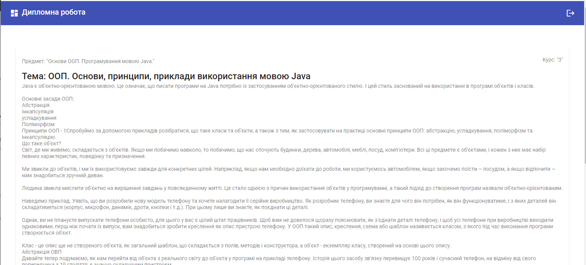

# Дипломна робота. Магістр. 2021. НУЧП
Виконавець - студент Колесник Андрій Юрійович, МКІп-201

## Розгортання локально

Виконайте команду `ng serve` у терміналі з проектом. Перейдіть на `http://localhost:4200/`. 

## Build

Виконайте команду `ng build` щоб побудувати проект. Артефакти автоматично сгенеруються у `dist/` директорію.

## Побудова проекта

Run `ng test` to execute the unit tests via [Karma](https://karma-runner.github.io).

## Додаткові команди

Щоб отримати інформацію щодо додаткових команд Angular CLI виконайте команду `ng help` ,
або перейдіть за посиланням [Команди Angular CLI](https://angular.io/cli) сторінка.

# Інформація про проект
## Передбачувані технічні та експлуатаційні результати роботи:
Результатом виконання кваліфікаційної роботи є веб-додаток, який вирішує наступні цілі:

- Реєстрація та авторизація користувача в системі, що складається з інтерфейсу користувача та взаємодії із сервером.
- Викладач має мати продивлятися список своїх предметів, створюючи шаблон практичної, лабораторної та навчальної роботи для виконання студентами та заповнення результатів. Результати студентів мають відображатися викладачу в онлайн режимі.
- Викладач має мати можливість коментувати на відповідь студента в режимі онлайн.
- Викладач має створити відкладену подію щодо роботи і прив'язати її до певної групи або до конкретного студента. Усі студенти мають повідомлення про цю подію.
- Система має надавати можливість викладачу та студенту переглядати історію проведених робіт та журнал успішності.
- Для первинної перевірки програмного коду на правильність його синтаксису в практичних роботах, система може мати валідатор для його.

## Опис Технологій
- Архітектура інформаційної комп’ютерної системи: клієнт-серверна.
- Мова розробки: TypeScript
- Технології використання: Angular 12
- Середа розробки: JetBrains Webstorm

## Реалізація сторінки реєстрації
Екрані реєстрація дозволяє новому користувачеві створити свою компанію в системі.

Екран реєстрації містить форму реєстрації, з полями необхідними для створення запису:
«Ім’я», «Прізвище», «Ім’я користувача», «Електронна адреса», «Пароль» та «Під підтвердження паролю».

## Реалізація сторінки авторизації
Сторінка авторизації слугує для отримання доступу до додатку для зареєстрованого користувача.
Для успішної авторизації необхідно заповнити форму авторизації.

Як і будь-яке інше поле в додатку, тут є перевірка наповненості, а кнопка підтвердження буде неактивною, поки поля не будуть заповнені.

## Реалізація головної сторінки додатку
З цього кроку відображення для різних користувачів буде погіршуватися, залежно від ролі (викладач\студент

На сторінці відображено список предметів, доступних користувачів, а також функціональна їх фільтрація за ім’ям

Справа можна побачити вигляд сторінки зі списком предметів, доступних студентів.

Для викладача на цій сторінці виглядатиме інакше.

Йому доступна більша кількість файлів, тому він може керувати предметами, які він веде.

До можливих дій, можна віднести створення предмету, його видалення, додавання до предмету практичного завдання, керування ним тощо.
Викладач також дає доступ студенту до предмету.

Як уже показано попередніх слайдах, користувач може скористатися пошуком предмету за ім’ям, що і продемонстровано знімком екрану справа.

Предмет може мітити практичні завдання. Студент може перейти до практичного завдання, а викладач може його створити, видалити та, як і студент, відкрити

## Реалізація сторінки практичного завдання

Практичною роботою може бути лабораторна\самостійна\контрольна та інші види робіт, що створені викладачем.
Така робота складається з назви, опису та списку завдань. Завдання може бути простим текстовим питанням, відповіддю на мовне програмування, або тестом.

Частину з назвою та описом показано на скріншоті справа

Після додавання викладачем завдань, вони з’являться в практичній роботі та будуть доступні студентам для заповнення.

Викладач може створити завдання, видалити його, а також подивитись відповіді студентів

## Реалізація чату в режимі реального часу
Побачивши відповідь, що дав студент на роботі, викладач може відкрити чат щодо цього завдання і дати свій коментар щодо його виконання.

Або студент може запитати щось у викладача, щодо заданого питання.

Переписка щодо завдання продемонстрована праворуч

## Реалізація сторінки з користувачами
Для адміністраторів та викладачів доступна сторінка списку користувачів системою, де можна отримати інформацію про користувачів: ПІБ, група, ім’я запису, курс.
Також тут існує функціональна зміна групи користувачів.

## Реалізація сторінки з групами
Для адміністраторів та викладачів доступна зі списком груп.
Тут можна знайти потрібну групу, побачити інформацію про неї, а також при необхідності створити нову, або видалити непотрібну.

